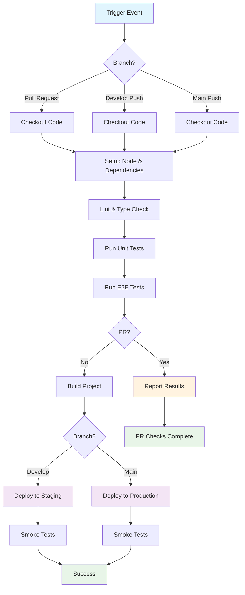

## Workflow Overview

**Purpose**: Automate testing, building, and deployment of the time-tracker application across development, staging, and production environments.

**Trigger Events**:

- Push to `main` branch (production deployment)
- Push to `develop` branch (staging deployment)
- Pull requests to `main` and `develop` branches (validation only)
- Manual trigger via workflow_dispatch

**Target Environments**: Development (PR validation), Staging (develop branch), Production (main branch)

---

## Execution Flow Diagram



---

## Jobs & Dependencies

| Job Name                 | Purpose                            | Dependencies       | Execution Context |
| ------------------------ | ---------------------------------- | ------------------ | ----------------- |
| `checkout`               | Clone repository code              | None               | ubuntu-latest     |
| `setup`                  | Install Node.js and dependencies   | checkout           | ubuntu-latest     |
| `lint`                   | Run ESLint and code quality checks | setup              | ubuntu-latest     |
| `type-check`             | TypeScript type checking           | setup              | ubuntu-latest     |
| `unit-tests`             | Run Jest/Vitest unit tests         | setup              | ubuntu-latest     |
| `e2e-tests`              | Run Playwright end-to-end tests    | setup              | ubuntu-latest     |
| `build`                  | Create production build artifact   | e2e-tests (non-PR) | ubuntu-latest     |
| `deploy-staging`         | Deploy to staging environment      | build              | ubuntu-latest     |
| `deploy-production`      | Deploy to production environment   | build              | ubuntu-latest     |
| `smoke-tests-staging`    | Validate staging deployment        | deploy-staging     | ubuntu-latest     |
| `smoke-tests-production` | Validate production deployment     | deploy-production  | ubuntu-latest     |

---

## Requirements Matrix

### Functional Requirements

| ID      | Requirement                           | Priority | Acceptance Criteria                                           |
| ------- | ------------------------------------- | -------- | ------------------------------------------------------------- |
| REQ-001 | Validate code quality on every PR     | High     | ESLint passes with zero errors, warnings configurable         |
| REQ-002 | Verify TypeScript compilation         | High     | Type checking passes without errors                           |
| REQ-003 | Execute automated test suite          | High     | All unit tests pass, E2E tests pass, coverage >80%            |
| REQ-004 | Generate production build             | High     | Build completes successfully, dist/ artifact created          |
| REQ-005 | Deploy to staging on develop push     | High     | Deployment succeeds, new version accessible at staging URL    |
| REQ-006 | Deploy to production on main push     | High     | Deployment succeeds, new version accessible at production URL |
| REQ-007 | Validate deployments with smoke tests | High     | Basic functionality verified in deployed environment          |
| REQ-008 | Provide deployment artifacts          | Medium   | Build artifacts available for 30 days                         |

### Security Requirements

| ID      | Requirement                     | Implementation Constraint                                                |
| ------- | ------------------------------- | ------------------------------------------------------------------------ |
| SEC-001 | Secure credential management    | Use GitHub Secrets for API keys, deployment tokens, database credentials |
| SEC-002 | Restrict production deployments | Only allow production deploys from main branch after PR review           |
| SEC-003 | Audit deployment changes        | Log all deployments with timestamp, actor, and version information       |
| SEC-004 | Verify build integrity          | Use Node version lock to prevent supply chain attacks                    |
| SEC-005 | Protect secrets in logs         | Mask sensitive values in workflow output and logs                        |

### Performance Requirements

| ID       | Metric                   | Target      | Measurement Method                              |
| -------- | ------------------------ | ----------- | ----------------------------------------------- |
| PERF-001 | PR validation time       | <10 minutes | Total time from commit to check completion      |
| PERF-002 | Build time               | <5 minutes  | Time from build job start to artifact creation  |
| PERF-003 | Deployment time          | <3 minutes  | Time from deployment start to URL accessibility |
| PERF-004 | E2E test execution       | <8 minutes  | Total Playwright test suite duration            |
| PERF-005 | Workflow startup latency | <1 minute   | Time from trigger event to first job execution  |

---

## Input/Output Contracts

### Inputs

```yaml
# Environment Variables
NODE_VERSION: "18.x"
NPM_REGISTRY: "https://registry.npmjs.org/"
STAGING_URL: "https://staging.time-tracker.example.com"
PRODUCTION_URL: "https://time-tracker.example.com"

# Repository Triggers
branches: ["main", "develop"]
paths-ignore: ["docs/**", "README.md", "*.md"]

# Manual Workflow Trigger
workflow_dispatch_inputs:
  environment: string # "staging" or "production"
  version_bump: string # "patch", "minor", "major"
```

### Outputs

```yaml
# Job Outputs
build_artifact: dist/ # Production-ready application bundle
coverage_report: coverage/ # Test coverage metrics (HTML report)
deployment_log: logs/deployment-${{ github.run_id }}.log # Deployment transcript
build_metadata:
  {
    "version": "1.0.0",
    "commit": "abc123",
    "timestamp": "2026-03-20T10:30:00Z",
  }
```

### Secrets & Variables

| Type     | Name                    | Purpose                               | Scope        |
| -------- | ----------------------- | ------------------------------------- | ------------ |
| Secret   | `DEPLOY_KEY_STAGING`    | SSH/API key for staging deployment    | Organization |
| Secret   | `DEPLOY_KEY_PRODUCTION` | SSH/API key for production deployment | Organization |
| Secret   | `SLACK_WEBHOOK`         | Slack notification endpoint           | Organization |
| Secret   | `SONAR_TOKEN`           | SonarQube code quality analysis       | Repository   |
| Variable | `AWS_REGION`            | AWS deployment region                 | Organization |
| Variable | `STAGING_BUCKET`        | S3 bucket for staging builds          | Organization |
| Variable | `PRODUCTION_BUCKET`     | S3 bucket for production builds       | Organization |

---

## Execution Constraints

### Runtime Constraints

- **Timeout**: 60 minutes maximum per workflow run
- **Build Job Timeout**: 15 minutes
- **Test Job Timeout**: 20 minutes
- **Deployment Job Timeout**: 10 minutes
- **Concurrency**: Maximum 3 concurrent runs per branch
- **Resource Limits**:
  - Memory: 7 GB (GitHub-hosted runner standard)
  - CPU: 2 cores (GitHub-hosted runner standard)

### Environmental Constraints

- **Runner Requirements**:
  - OS: Ubuntu 22.04 LTS (ubuntu-latest)
  - Node.js: v18.x (specified in package.json)
  - npm: v9.x or later
  - Playwright: Chromium, Firefox, WebKit browsers

- **Network Access**:
  - npm registry (registry.npmjs.org)
  - GitHub API
  - Deployment endpoints (staging/production servers)
  - Slack API (for notifications)

- **Permissions**:
  - Read access to repository code
  - Write access to deployment environments
  - Read/Write access to GitHub Deployments API
  - Publish to artifact storage

---

## Error Handling Strategy

| Error Type                    | Response                          | Recovery Action                                           |
| ----------------------------- | --------------------------------- | --------------------------------------------------------- |
| Lint Failure                  | Fail PR check, block merge        | Developer fixes code style issues and pushes update       |
| Type Check Failure            | Fail PR check, block merge        | Developer fixes TypeScript errors                         |
| Unit Test Failure             | Fail workflow, notify team        | Developer debugs test failures, commits fix               |
| E2E Test Failure              | Fail workflow, notify team        | Developer investigates flaky test or bug, implements fix  |
| Build Failure                 | Fail workflow, post comment on PR | Developer checks build logs, resolves dependencies/config |
| Deployment Failure            | Rollback to previous version      | Alert on-call engineer, investigate deployment logs       |
| Staging Smoke Test Failure    | Notify team, flag for review      | QA validates staging environment manually                 |
| Production Smoke Test Failure | Trigger automated rollback        | Alert critical incident, initiate incident response       |

---

## Quality Gates

### Gate Definitions

| Gate               | Criteria                         | Bypass Conditions                             |
| ------------------ | -------------------------------- | --------------------------------------------- |
| Code Quality       | ESLint passes with 0 errors      | None (must pass)                              |
| Type Safety        | TypeScript compilation succeeds  | None (must pass)                              |
| Unit Tests         | All tests pass, >80% coverage    | Engineering lead approval + 24hr review       |
| E2E Tests          | All tests pass, <5% flakiness    | Product owner + engineering lead approval     |
| Security Scan      | No high/critical vulnerabilities | Security team approval                        |
| Peer Review        | Minimum 1 approval on PR         | Only for feature branches, hotfixes require 2 |
| Staging Deployment | Smoke tests pass                 | Manual override with 2 approvals              |

---

## Monitoring & Observability

### Key Metrics

- **Success Rate**: Target 99% workflow success rate (failures due to code quality/tests, not infrastructure)
- **Execution Time**:
  - PR validation: <10 minutes (p95)
  - Production deployment: <15 minutes (p95)
- **Deployment Frequency**: Measure deploys to production per day/week
- **Lead Time**: Time from merge to main to production deployment
- **Mean Time to Recovery**: Time to detect and fix deployment failures

### Alerting

| Condition                             | Severity | Notification Target                                 |
| ------------------------------------- | -------- | --------------------------------------------------- |
| Production deployment failure         | Critical | #urgent-devops Slack channel, page on-call engineer |
| >3 consecutive PR validation failures | High     | #engineering Slack channel                          |
| E2E test flakiness >10%               | Medium   | Post comment on PR, log issue                       |
| Staging deployment failure            | Medium   | #engineering Slack channel                          |
| Build time >10 minutes                | Low      | Workflow summary                                    |

---

## Integration Points

### External Systems

| System                      | Integration Type | Data Exchange                                           | SLA Requirements                       |
| --------------------------- | ---------------- | ------------------------------------------------------- | -------------------------------------- |
| AWS S3 / Deployment Service | API (REST)       | Upload build artifact, trigger deployment               | 99.9% availability                     |
| Slack                       | Webhook (JSON)   | Deployment notifications, status updates                | Best effort                            |
| SonarQube                   | API (REST)       | Code quality metrics, coverage data                     | 99% availability during business hours |
| GitHub                      | REST/GraphQL API | Status checks, deployment records, pull request updates | GitHub SLA (99.9%)                     |
| npm Registry                | HTTPS Registry   | Download dependencies                                   | 99.5% availability                     |

### Dependent Workflows

| Workflow              | Relationship            | Trigger Mechanism                         |
| --------------------- | ----------------------- | ----------------------------------------- |
| Security Scanning     | Parallel (optional)     | Triggered on same events as main workflow |
| Performance Testing   | Sequential after deploy | Follows successful deployment to staging  |
| Accessibility Testing | Parallel (optional)     | Runs alongside E2E tests                  |

---

## Compliance & Governance

### Audit Requirements

- **Execution Logs**: Retain for 90 days, archive to S3 for 7 years
- **Approval Gates**: Document all manual approvals with actor and timestamp
- **Change Control**: Every deployment must have corresponding PR/ticket reference
- **Version Tracking**: Tag all production deployments in git with semantic versioning

### Security Controls

- **Access Control**:
  - Production deployments restricted to main branch
  - Deployment credentials stored in GitHub Secrets
  - Only designated team members can approve production deployments

- **Secret Management**:
  - Rotate deployment keys quarterly
  - Audit secret access via GitHub logs
  - Never commit secrets to repository

- **Vulnerability Scanning**:
  - Scan dependencies with `npm audit` on every build
  - Fail build if high/critical vulnerabilities detected
  - Weekly scanning of main branch

---

## Edge Cases & Exceptions

### Scenario Matrix

| Scenario                          | Expected Behavior                             | Validation Method                                     |
| --------------------------------- | --------------------------------------------- | ----------------------------------------------------- |
| PR from fork                      | Run read-only tests, skip deployment          | Verify deployment jobs skipped in workflow logs       |
| Commit to main without PR         | Deploy immediately after tests pass           | Verify production deployment triggered                |
| Tag pushed to repository          | Trigger release workflow (separate)           | Tag workflow runs independently                       |
| Concurrent pushes to same branch  | Queue runs sequentially by branch             | GitHub Actions concurrency group handling             |
| Manual workflow_dispatch run      | Allow deployment to chosen environment        | Accept environment parameter in workflow inputs       |
| Node.js dependency conflict       | Fail during npm install with detailed message | Clear error message, developer resolves locally first |
| Network timeout during deployment | Retry up to 3 times with exponential backoff  | Log retry attempts in deployment log                  |
| Out-of-disk-space runner          | Workflow fails, auto-cleanup not enough       | Alert, runner requires manual maintenance             |

---

## Validation Criteria

### Workflow Validation

- **VLD-001**: All required status checks appear on PR before merge permission granted
- **VLD-002**: Workflow completes within timeout limits for all jobs
- **VLD-003**: Build artifact is reproducible (same input = same output)
- **VLD-004**: Secrets are never exposed in logs or artifacts
- **VLD-005**: Deployment only occurs on protected branches or after approval
- **VLD-006**: Rollback mechanism executes successfully on deployment failure

### Performance Benchmarks

- **PERF-001**: PR checks complete within 10 minutes (p95)
- **PERF-002**: Build artifact creation <5 minutes
- **PERF-003**: Staging deployment <3 minutes
- **PERF-004**: Production deployment <5 minutes including smoke tests

---

## Change Management

### Update Process

1. **Specification Update**: Modify this document first, describe proposed changes
2. **Review & Approval**: Obtain DevOps team and Engineering lead approval
3. **Implementation**: Apply changes to workflow YAML in feature branch
4. **Testing**: Test in non-production environment, verify against security requirements
5. **Deployment**: Merge feature branch, activation occurs on next build
6. **Verification**: Confirm workflow executes with new specifications

### Version History

| Version | Date       | Changes                                           | Author      |
| ------- | ---------- | ------------------------------------------------- | ----------- |
| 1.0     | 2026-03-20 | Initial specification for build & deploy workflow | DevOps Team |

---

## Related Specifications

- Security scanning workflow specification (TBD)
- Performance testing workflow specification (TBD)
- Release and versioning policy
- AWS deployment infrastructure specifications
- Time-tracker application architecture documentation
